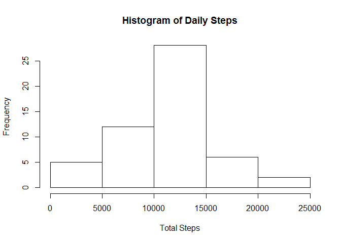
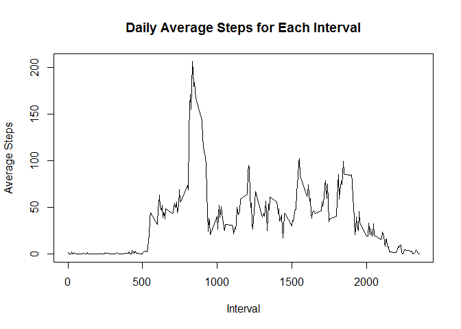

# Reproducible Research: Peer Assessment 1


## Loading and preprocessing the data

The code below points to the correct working directory, unzips the data file
and reads the CSV file


```r
file.dir <- "C:/Users/ssharaf/Documents/RWD/Course5/Assignment1"
setwd(file.dir)
zip.file <- "repdata_data_activity.zip"
file.name <- "activity.csv"
if (!file.exists(file.name)){
    unzip(zip.file)
}
data <- read.csv(file.name)
```


## What is mean total number of steps taken per day?

The code below calculates the total steps for each day and creates a histogram.
It then reports the mean and median of daily steps.
Note that NA (missing) values are ignored.


```r
daily.steps <- tapply(data$steps, data$date, sum)
hist(daily.steps, main = "Histogram of Daily Steps", xlab = "Total Steps")
```

 

```r
daily.steps <- tapply(data$steps, data$date, sum, na.rm=TRUE)
daily.steps.mean <- mean(daily.steps)
daily.steps.median <- median(daily.steps)
```

The mean of daily steps is 9354.2295082.
The median of daily steps is 10395.

## What is the average daily activity pattern?
The code below calculates the average steps for each interval for all days.
It then reports the interval with the maximum average and that average.
Note that NA (missing) values are removed.


```r
interval.averages <- cbind(unique(data$interval), 
                           data.frame(tapply(data$steps, data$interval, mean, 
                                       simplify = TRUE, na.rm=TRUE),
                                row.names=NULL))
colnames(interval.averages) <- c("Interval", "Steps")
plot(interval.averages$Interval,interval.averages$Steps, type="l", 
     main = "Daily Average Steps for Each Interval", xlab = "Interval", 
     ylab = "Average Steps")
```

 

```r
##max(interval.averages)
interval.averages.maximum <- max(interval.averages$Steps)
interval.averages.maximum.row <- (interval.averages[which.max(interval.averages$Steps),])
```

The maxim average steps is 206.1698113 found in 
interval 835.

## Imputing missing values


```r
sum(is.na(data$steps))
```

```
## [1] 2304
```

```r
sum(complete.cases(data))
```

```
## [1] 15264
```

## Are there differences in activity patterns between weekdays and weekends?
