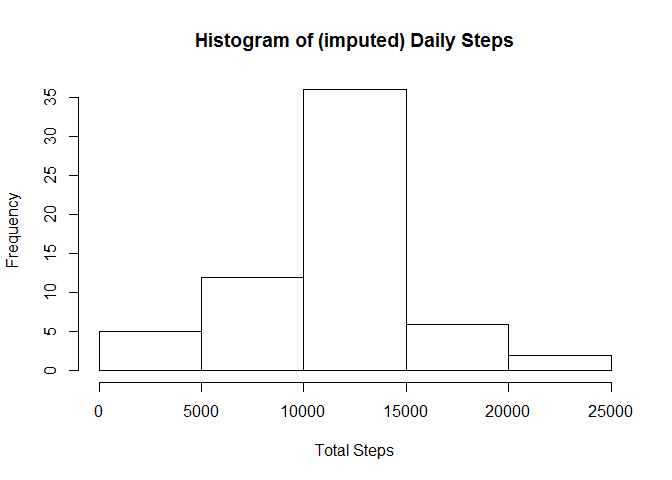
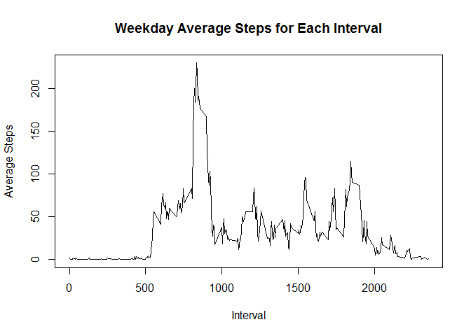
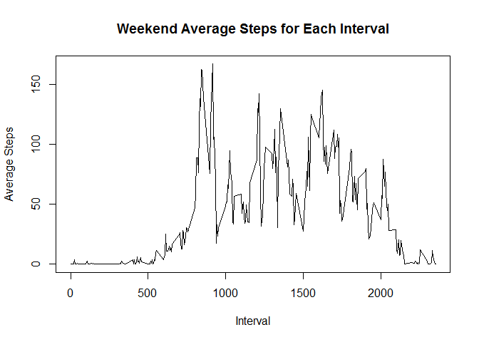

# Reproducible Research: Peer Assessment 1


## Loading and preprocessing the data

The code below points to the correct working directory, unzips the data file
and reads the CSV file


```r
file.dir <- "C:/Users/ssharaf/Documents/RWD/Course5/Assignment1"
setwd(file.dir)
zip.file <- "repdata_data_activity.zip"
file.name <- "activity.csv"
if (!file.exists(file.name)){
    unzip(zip.file)
}
data <- read.csv(file.name)
```


## What is mean total number of steps taken per day?

The code below calculates the total steps for each day and creates a histogram.
It then reports the mean and median of daily steps.
Note that NA (missing) values are ignored.


```r
daily.steps <- tapply(data$steps, data$date, sum)
hist(daily.steps, main = "Histogram of Daily Steps", xlab = "Total Steps")
```

 

```r
daily.steps <- tapply(data$steps, data$date, sum, na.rm=TRUE)
daily.steps.mean <- mean(daily.steps)
daily.steps.median <- median(daily.steps)
```

The mean of daily steps is 9354.2295082.
The median of daily steps is 10395.

## What is the average daily activity pattern?
The code below calculates the average steps for each interval for all days.
It then reports the interval with the maximum average and that average.
Note that NA (missing) values are removed.


```r
interval.averages <- cbind(as.integer(unique(data$interval)), 
                           data.frame(tapply(data$steps, data$interval, mean, 
                                             simplify = TRUE, na.rm=TRUE)))
colnames(interval.averages) <- c("Interval", "Steps")
plot(interval.averages$Interval,interval.averages$Steps, type="l", 
     main = "Daily Average Steps for Each Interval", xlab = "Interval", 
     ylab = "Average Steps")
```

 

```r
##max(interval.averages)
interval.averages.maximum <- max(interval.averages$Steps)
interval.averages.maximum.row <- (interval.averages[which.max(
    interval.averages$Steps),])
```

The maxim average steps is 206.1698113 found in 
interval 835.

## Imputing missing values


```r
missing.values <- sum(is.na(data$steps))
imputed.data <- data

for (i in 1:17568){
    if(is.na(imputed.data[i, "steps"])){
        imputed.data[i, "steps"] <- interval.averages[interval.averages$Interval
                                                      ==imputed.data[i,
                                                      "interval"],2]
    }
}
```

2304 records have missing values. 
We replaced the missing steps value in these records with the daily average 
for that interval.
We will now recalculate the total steps for each day and creates a histogram.
We then report the mean and median of daily steps.


```r
new.daily.steps <- tapply(imputed.data$steps, imputed.data$date, sum)
hist(new.daily.steps, main = "Histogram of (imputed) Daily Steps", 
     xlab = "Total Steps")
```

 

```r
new.daily.steps.mean <- as.integer(mean(new.daily.steps))
new.daily.steps.median <- as.integer(median(new.daily.steps))
```

Clearly, the mean of daily steps went up from 9354.2295082 
to 10766.
The median of daily steps went up from 10395 to 
10766.
Additionally, the histogram shows that the frequency of peak number of total 
daily steps (10,000 to 15,000) has gone up.

## Are there differences in activity patterns between weekdays and weekends?

We now divide the imputed data into weekday and weekend groups and for each 
group plot average steps for each interval for all days.


```r
library(dplyr)
```

```
## 
## Attaching package: 'dplyr'
## 
## The following object is masked from 'package:stats':
## 
##     filter
## 
## The following objects are masked from 'package:base':
## 
##     intersect, setdiff, setequal, union
```

```r
imputed.data <- mutate(imputed.data, weekday = weekdays(as.Date(date)))
imputed.data.weekend <- subset(imputed.data, weekday %in% c("Saturday", 
                                                             "Sunday"))
imputed.data.weekday <- subset(imputed.data, weekday %in% c("Monday", 
                                                           "Tuesday",
                                                           "Wednesday",
                                                           "Thursday",
                                                           "Friday"))

interval.averages.weekday <- cbind(as.integer(unique(imputed.data.weekday$interval)), 
                           data.frame(tapply(imputed.data.weekday$steps, 
                                             imputed.data.weekday$interval, mean, 
                                             simplify = TRUE, na.rm=TRUE)))
colnames(interval.averages.weekday) <- c("Interval", "Steps")
plot(interval.averages.weekday$Interval,interval.averages.weekday$Steps, 
     type="l", 
     main = "Weekday Average Steps for Each Interval", xlab = "Interval", 
     ylab = "Average Steps")
```

 

```r
interval.averages.weekend <- cbind(as.integer(unique(imputed.data.weekend$interval)), 
                           data.frame(tapply(imputed.data.weekend$steps, 
                                             imputed.data.weekend$interval, mean, 
                                             simplify = TRUE, na.rm=TRUE)))
colnames(interval.averages.weekend) <- c("Interval", "Steps")
plot(interval.averages.weekend$Interval,interval.averages.weekend$Steps, 
     type="l", 
     main = "Weekend Average Steps for Each Interval", xlab = "Interval", 
     ylab = "Average Steps")
```

 

The plots clearly show that there is more activity in the weekends compared to 
weekdays.
